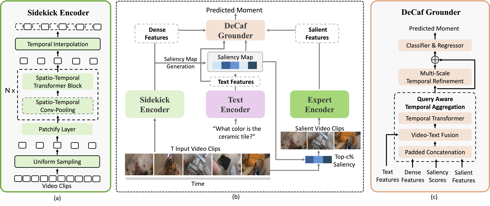
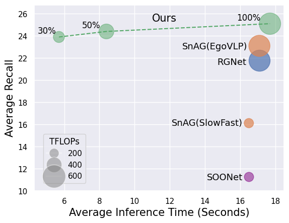

# CVPR2025-DeCafNet
Official Repo for CVPR 2025 Paper -- DeCafNet: Delegate and Conquer for Efficient Temporal Grounding in Long Videos

[](https://paperswithcode.com/sota/temporal-sentence-grounding-on-charades-sta?p=decafnet-delegate-and-conquer-for-efficient)
[](https://paperswithcode.com/sota/temporal-sentence-grounding-on-ego4d-goalstep?p=decafnet-delegate-and-conquer-for-efficient)
[](https://paperswithcode.com/sota/video-grounding-on-mad?p=decafnet-delegate-and-conquer-for-efficient)
[](https://paperswithcode.com/sota/natural-language-queries-on-ego4d?p=decafnet-delegate-and-conquer-for-efficient)
[](https://paperswithcode.com/sota/natural-language-moment-retrieval-on-mad?p=decafnet-delegate-and-conquer-for-efficient)
[](https://paperswithcode.com/sota/natural-language-moment-retrieval-on-tacos?p=decafnet-delegate-and-conquer-for-efficient)



<p align="center">
    
</p>

<!-- ## TODO

- [ ] Release training code
- [ ] Add detailed installation instructions
- [ ] Provide usage examples and demo scripts
- [ ] Upload additional model visualizations
- [ ] Extend documentation for datasets and evaluation
- [ ] Add citation and contact information -->


## Installation
1. Set up the environment with conda:
    ```bash
    conda env create -f environment.yml
    conda activate decafnet
    ```

2. Install NMS
    ```bash
    cd ./libs/nms
    python setup_nms.py install --user
    ```

## Evaluation

1. Download model checkpoint and data from [here](https://drive.google.com/drive/folders/1Dq9gb7NxN3P8SomuSKVbiOkWNMNPZoZI?usp=sharing). 

2. Update the path in opt.yaml in model checkpoint to point to data path

3. Run evaluation the following command. This will reproduce the result of DeCafNet-30\% on Ego4D-NLQ.
```bash
python eval.py --name "checkpoint/decafnet_30_nlq" --ckpt "6-36000" 
```

*we will release full training and eval code soon*

## Citation
```text
@inproceedings{
        Lu2025DeCafNet,
        title={DeCafNet: Delegate and Conquer for Efficient Temporal Grounding in Long Videos},
        author={Zijia Lu and A S M Iftekhar and Gaurav Mittal and Tianjian Meng and Xiawei Wang and Cheng Zhao and Rohith Kukkala and Ehsan Elhamifar and Mei Chen},
        booktitle={Proceedings of the IEEE/CVF Conference on Computer Vision and Pattern Recognition (CVPR)},
        year={2025},
        }
```

